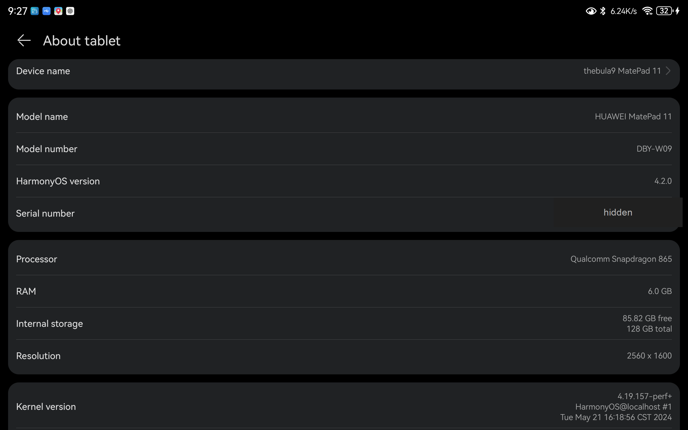
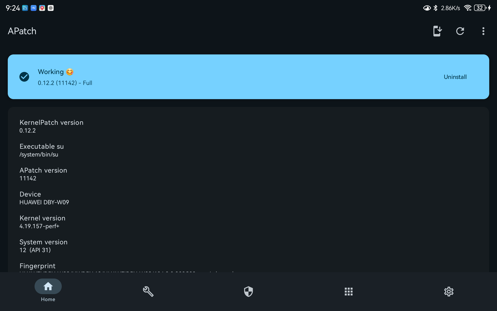
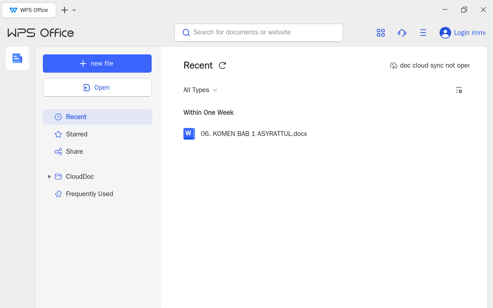
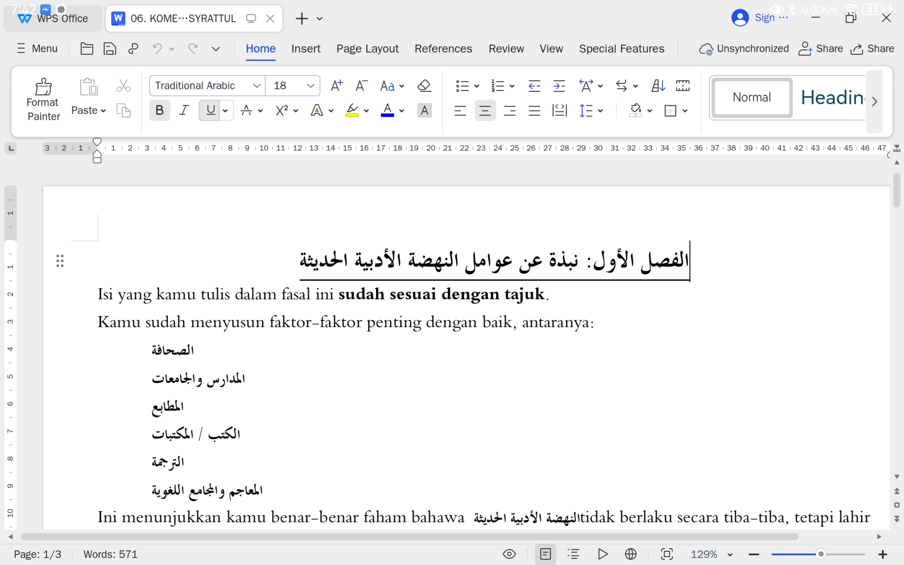

# Huawei MatePad 11 2021 DBY-W09 China ROM, Bootloader Unlock, Root, and WPS Office PC English Guide

This repository documents the full workflow used on a Huawei MatePad 11 2021 `DBY-W09` to:

- rebrand/convert the device to China region firmware,
- update to HarmonyOS 4.2 China ROM,
- unlock the bootloader using the XDA Huawei Bootloader Tool v2 workflow,
- preserve EDL access through fastboot,
- root using APatch,
- install WPS Office PC in English,
- install Traditional Arabic and Arabic Typesetting font support for WPS Office PC.

This is not an official Huawei guide. It is a documented field workflow based on the files, tests, backups, and fixes used on one DBY-W09 device.

## Author Note

This guide was created from my own hands-on testing on a Huawei MatePad 11 2021 DBY-W09, with the help of Codex using Thinking 5.5 and full workspace access to organize, verify, document, and clean up the project from A to Z.

I am not a professional firmware engineer, Android reverse engineer, or Huawei technician. I am an enthusiast user who went through this process myself and wanted to document it clearly to help other DBY-W09 users.

Please treat this guide as a community-documented workflow, not an official Huawei procedure. Read everything carefully, make your own backups, and proceed at your own risk.

## Final Tested Result

| Item | Result |
|---|---|
| Device | Huawei MatePad 11 2021 |
| Model | DBY-W09 |
| Chipset | Qualcomm Snapdragon 865 |
| Target region | ALL/CN, C00 |
| Target ROM | HarmonyOS 4.2 China |
| Bootloader | Unlocked |
| EDL access on HOS 4.2 | Preserved through fastboot |
| Root | APatch |
| WPS Office PC | English UI |
| Arabic support | Traditional Arabic + Arabic Typesetting fonts |

## Visual Proof

<p>
  
  
  
  
</p>

More screenshots are available in [`assets/screenshots`](assets/screenshots).

## The Golden Rule

EDL is the main road in this guide.

Do not continue unless EDL access is confirmed and a full backup has been made.

Without EDL, you may lose the ability to recover from a failed flash, wrong OEMINFO, broken boot image, or bootloop.

```text
No EDL access = stop.
No backup = stop.
Wrong model = stop.
```

## Critical Upgrade Rule

Do not upgrade to HarmonyOS 4.2 through OTA or HiSuite after unlocking the bootloader and flashing the EDL-friendly ABL.

OTA and HiSuite updates may reset/overwrite the ABL behavior and remove fastboot-to-EDL access.

Use HiSuite only for rollback/downgrade when needed. For upgrading to HarmonyOS 4.2 in this workflow, use manual PC flashing with the prepared firmware packages.

## Known Unlock-Compatible Firmware

Based on this workflow, bootloader unlock and EDL-related preparation should be done before HarmonyOS 4.2.

Known compatible firmware states:

- HarmonyOS 2.x
- HarmonyOS 3.0.0.312, or the last HarmonyOS 3 rollback build offered by HiSuite

HarmonyOS 4.2 is more restricted. If you update first, you may lose the easy path to unlock or preserve EDL access.

## Recommended Reading Order

1. [Disclaimer and Compatibility](docs/00-disclaimer-and-compatibility.md)
2. [Required Files](docs/01-required-files.md)
3. [PC Setup and Drivers](docs/02-pc-setup-and-drivers.md)
4. [EDL Access and Full Backup](docs/03-edl-access-and-backup.md)
5. [Rebrand to China ROM](docs/04-rebrand-to-china-rom.md)
6. [Bootloader Unlock](docs/05-unlock-bootloader.md)
7. [Preserve EDL on HarmonyOS 4.2](docs/06-preserve-edl-access.md)
8. [Flash HarmonyOS 4.2 China ROM](docs/07-flash-harmonyos-42.md)
9. [Root with APatch](docs/08-root-with-apatch.md)
10. [WPS Office PC English](docs/09-wps-office-pc-english.md)
11. [Arabic Font Support](docs/10-arabic-font-support.md)
12. [Troubleshooting](docs/11-troubleshooting.md)
13. [References and Credits](docs/12-references-and-credits.md)

## File Package

The companion file package is hosted separately on Google Drive:

[DBY-W09 MatePad 11 2021 China ROM Root WPS Package](https://drive.google.com/drive/folders/1WjF99DV-UTEPkM3YRkm77TCNjAOZIpk9?usp=sharing)

After downloading, check `00_READ_FIRST/CHECKSUMS_SHA256.txt` before flashing anything.

Important: `converted_oeminfo.img` is not provided because it must be generated by each user from their own device backup. Do not flash another user's converted OEMINFO.

## High-Level Workflow

```text
Confirm model DBY-W09
  -> Install PC drivers and tools
  -> Confirm ADB/Fastboot
  -> Enter EDL/9008
  -> Full backup + GPT + ABL + OEMINFO
  -> Convert/rebrand OEMINFO to ALL/CN
  -> DLOAD China base when required
  -> Roll back/prepare unlock-compatible firmware
  -> Unlock bootloader using Huawei Bootloader Tool v2 from XDA
  -> Flash EDL-friendly ABL
  -> Manually flash HarmonyOS 4.2 China ROM from PC
  -> Root with APatch
  -> Install WPS Office PC
  -> Install APatch module for English UI + Arabic fonts
```

## What This Guide Keeps Private

This GitHub repository does not store large firmware packages directly. Large files, where shared, are kept in the separate file package above.

This guide does not provide personal device dumps such as:

- original OEMINFO from the author's device,
- converted OEMINFO from the author's device,
- GPT/NV/persist/userdata backups,
- full EDL backup,
- paid tools or cracked tools.

Generate your own device-specific files and keep your backups private.
