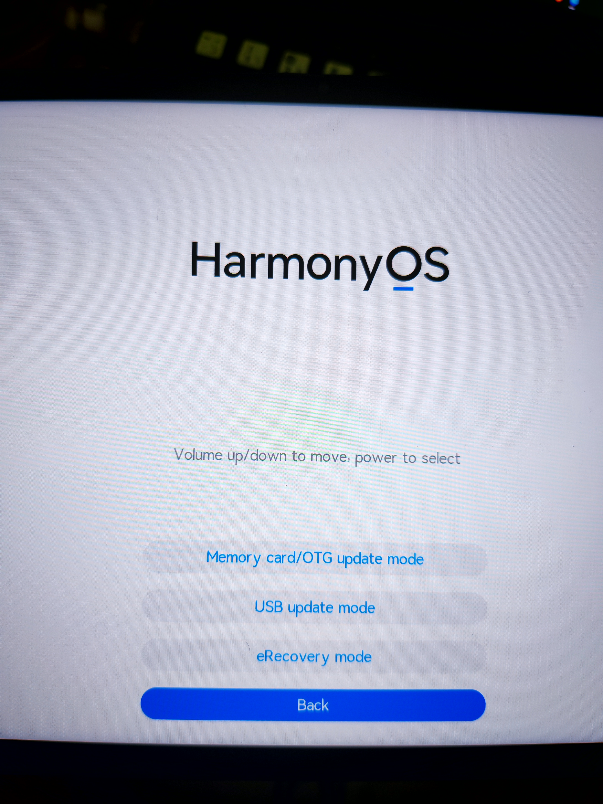
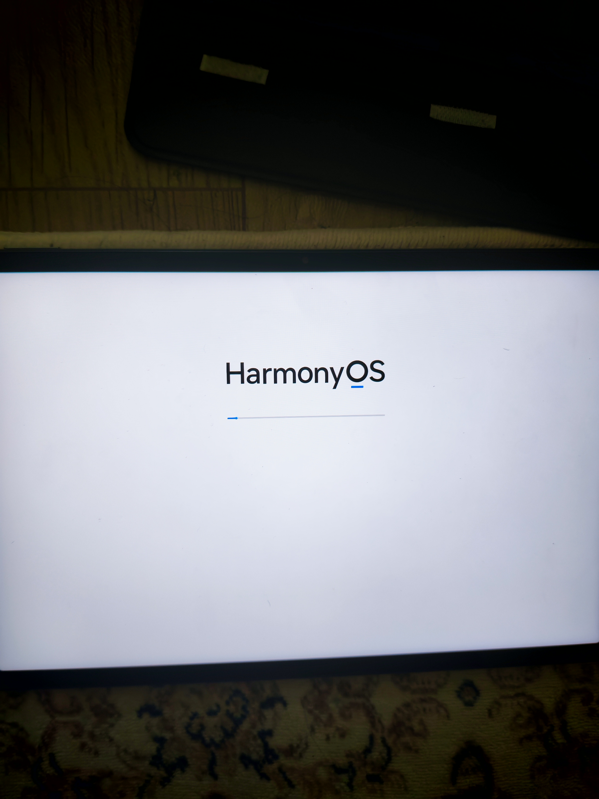
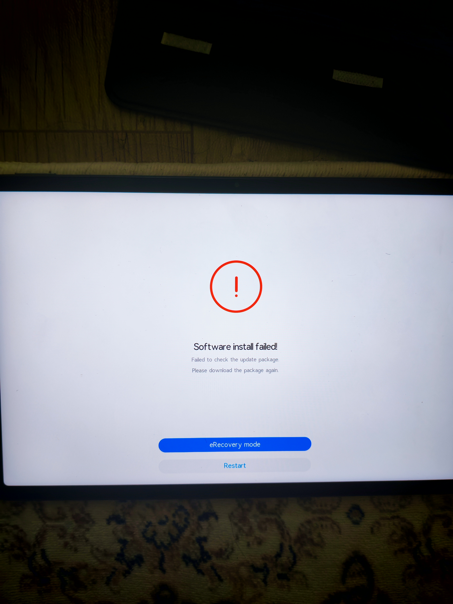
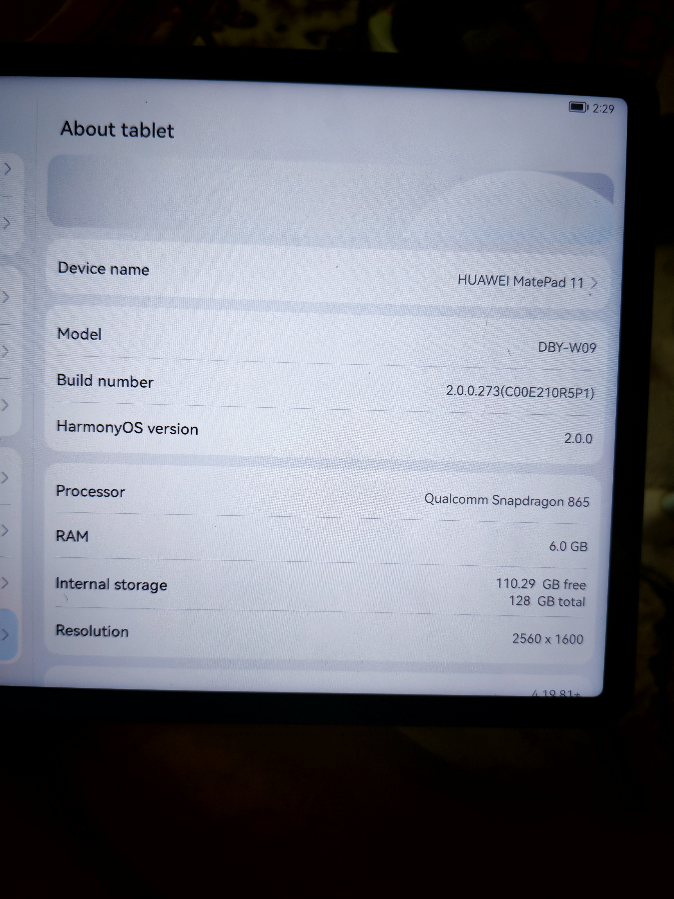

# Screenshots

This folder contains visual proof and reference screenshots from the tested DBY-W09 workflow.

## Included

| File | Shows |
|---|---|
| `01-recovery-update-menu-otg-mode.jpg` | Huawei recovery update menu with Memory card/OTG update mode |
| `02-dload-installing-update.jpg` | DLOAD package installing through recovery |
| `03-dload-package-check-failed-example.jpg` | Example of DLOAD package check failure |
| `04-about-tablet-cn-c00-after-rebrand.jpg` | DBY-W09 on China/C00 firmware after rebrand stage |
| `05-wps-pc-english-arabic-proof.jpg` | WPS Office PC in English with Traditional Arabic font and Arabic text rendering |
| `06-live-about-tablet-build-hos42-cn.png` | Live ADB screenshot of DBY-W09 on HarmonyOS 4.2 with serial number hidden |
| `07-live-apatch-status.png` | Live ADB screenshot showing APatch working/root status |
| `08-live-home-wps-pc-icon.png` | Live ADB screenshot showing WPS Office PC installed on the launcher |
| `09-live-wps-office-pc-opened.png` | Live ADB screenshot showing WPS Office PC opened with English UI |
| `10-live-root-module-verification.txt` | Live ADB root and APatch module verification output |

## Gallery

### Recovery OTG Update Mode

### DLOAD Installing Update

### DLOAD Error Example

### China/C00 Firmware After Rebrand

### WPS Office PC English + Arabic

### Live HarmonyOS 4.2 Device Info

### Live APatch Root Status

### Live WPS Office PC Installed

### Live WPS Office PC English UI

## Notes

The live HarmonyOS 4.2 About tablet screenshot has the serial number hidden. Avoid adding screenshots that expose private device/account information.
